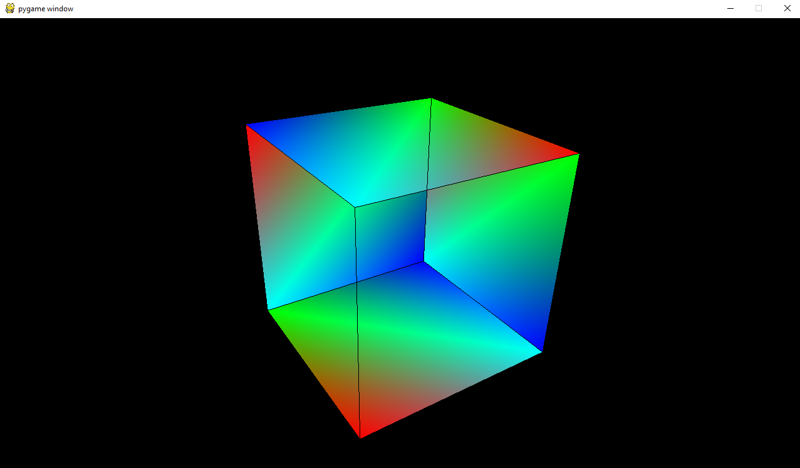

# OpenGL in Python
Messing with OpenGL in Python.

**Idea/goal:** Learn OpenGL properly through some (more or less exciting) exercises/small projects.

## Cube
**Libraries used:** OpenGL for Python, pygame

**Python version used:** 3.8.3

Simple rotating cube with added colors and basic movement (up,down,right,left) so you can make the cube move around.

**In order to run it one will have to:**

**1.** Compile and run the source code.
